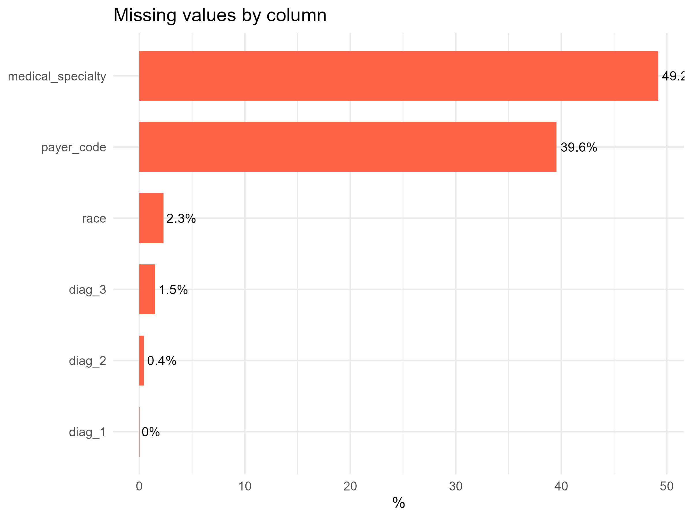

## Goal
Predict patient readmission using EHR predictors.

## Data Structure
- Sample size: 25000
- Response: readmitted
- Predictors: 46 (35 categorical, 11 numeric)

## Class Distribution
{height=0.6\textheight}

## Missingness
{height=0.6\textheight}

## One-Hot + Impute + Box-Cox + Center/Scale
- Robust OHE (single-level train cats dropped; unseen test levels → Other)
- kNN imputation (k=5)
- Box-Cox (shifted to positive), then center/scale

## Correlations
{height=0.6\textheight}
- High-correlation removal at |r|>0.9

## Skewness Reduction
{height=0.6\textheight}
- Box-Cox transform significantly reduced skewness in numeric predictors.

## Outlier Mitigation (Boxplots)
{height=0.6\textheight}
- Transformations also help in managing the influence of outliers.

## Outlier Reduction (Counts)
{height=0.6\textheight}
- The number of outliers is significantly reduced after transformation.

## PCA
{height=0.55\textheight}
- Retained 39 PCs (≥95% variance)

## PCA Correlation Check
{height=0.6\textheight}
- Heatmap confirms PCA components are uncorrelated.

## Spatial Sign
- Alternate set to mitigate outliers

## Train/Test & Resampling
- Split: 80% train / 20% test (stratified)
{height=0.6\textheight}
- Upsampled and downsampled sets prepared

## What We'll Use For Modeling
- Start with Box-Cox + center/scale + correlation pruning
- Compare: with/without PCA (39 PCs)
- Evaluate with original vs upsampled training
- Keep spatial-sign variant for robustness checks
